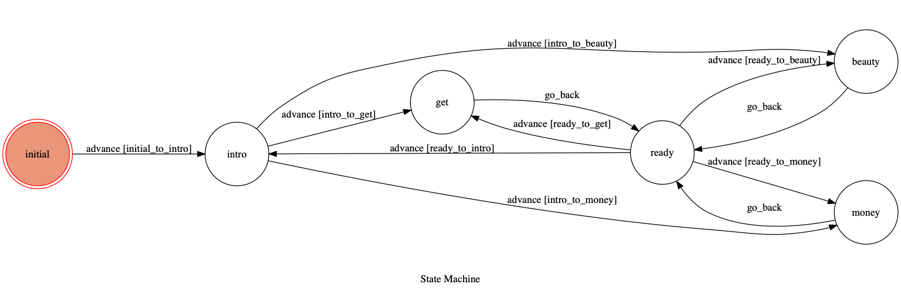
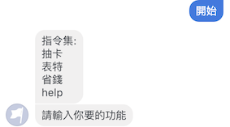
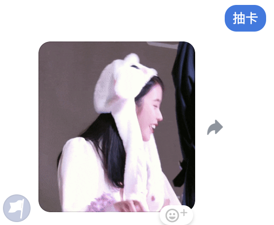
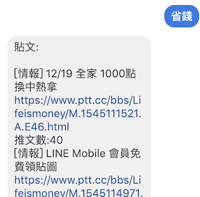
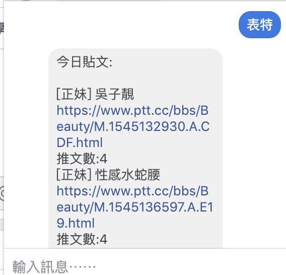

## Intro

This Project is for 2019 T.O.C Course in NCKU CSIE 

A Facebook messenger bot based on a finite state machine

## Framework

## State name:
`initial`,
`intro`,
`ready`,
`get`,
`beauty`,
`money`

## Usage
    

#### initial:

#### get:

#### money:

#### Beauty:

#### help:
Go Back to introduction...

## Reference

https://goo.gl/u9eQke ,給初學者的 Python 網頁爬蟲與資料分析

https://developers.facebook.com/ Facebook Messenger API

https://www.crummy.com/software/BeautifulSoup/bs4/doc/ Beautiful Soup Documentation
